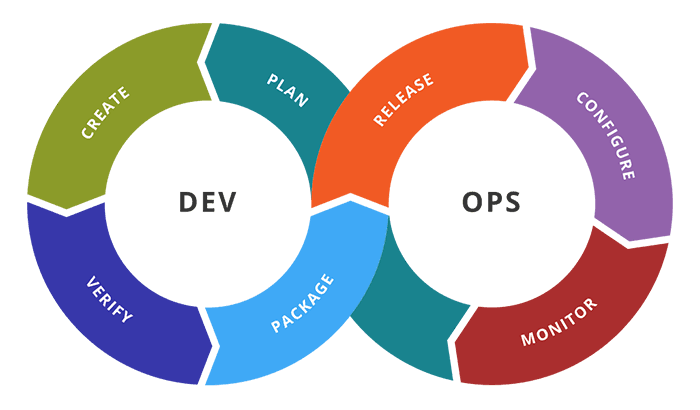
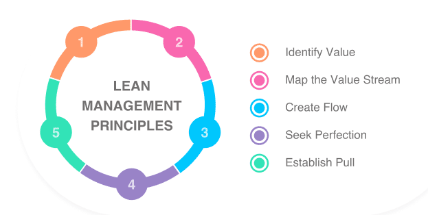

## Introducción a DevOps

### ¿Por qué es importante DevOps?

DevOps permite que los roles que antes estaban aislados (desarrollo, operaciones de TI, ingeniería de la calidad y
seguridad) se coordinen y colaboren para producir productos mejores y más confiables.

Al adoptar una cultura de DevOps junto con prácticas y herramientas de DevOps, los equipos adquieren la capacidad de
responder mejor a las necesidades de los clientes, aumentar la confianza en las aplicaciones que crean y alcanzar los
objetivos empresariales en menos tiempo.

### ¿Que es DevOps?

DevOps es un movimiento que llega para eliminar esas barreras invisibles, eliminar silos de trabajo aislados,
automatizar muchos procesos manuales, y generar transformación técnica y cultural dentro de los equipos Dev y Ops.
Logrando además, que esto se pueda ver reflejado en retorno de inversión para la compañía.

El objetivo principal de DevOps es que se cumplan los objetivos Dev y Ops.

“Hacer más rápido el ciclo de vida del software con entrega continua de alta calidad”

### ¿Qué es CALMS?

CALMS es un framework que evalúa la capacidad de una empresa para adoptar procesos DevOps, así como una forma de medir
el éxito durante una transformación DevOps. El acrónimo fue acuñado por Jez Humble, coautor de "The DevOps Handbook", y
significa: **Culture, Automation, Lean, Measurement y Sharing**, que representan los valores de DevOps.

### ¿Qué es Chaos Engineering?

"Chaos Engineering" consiste en experimentar con un sistema de software introduciendo fallos para aumentar el nivel de
resiliencia y robustez, generando confianza en la capacidad de dicho sistema para soportar condiciones inesperadas.

### ¿Qué es la integración continua?

La integración continua es realmente un gran conjunto de prácticas que se enfocan específicamente en la construcción del
software.

Es una práctica basada en ejecución automatizada de ciertos procesos después de cada incorporación de cambios a un
repositorio de software.

Un claro ejemplo es que cuando un miembro del equipo realiza un commit sobre el control de versiones (git por ejemplo),
el proyecto se compila y se ejecutan todas sus pruebas unitarias y code analysis. Todo esto de forma automática.

### ¿Qué es el Continuous Testing?

Es el proceso de ejecutar pruebas automatizadas como parte de la entrega de software para obtener feedback sobre los
riesgos comerciales asociados con una versión candidata de software lo más rápido posible.

El Continuous Testing busca acercar el equipo del aseguramiento de la calidad al equipo de desarrollo, que las pruebas
se realicen de forma transversal y no al final del proceso de desarrollo.

### ¿Qué es Agile?

Agile es la capacidad de crear y responder al cambio utilizando una serie de frameworks y prácticas, como por ejemplo:
Scrum, SAFe, Kanban y Lean, que se soportan sobre algunos de sus valores y principios.

### ¿Qué es Lean Management?

DevOps también se complementa con el marco de referencia Lean, que se enfoca en construir productos de manera correcta, reduciendo el desperdicio y la mala calidad.

Lean es una aproximación para trasladar al mundo empresarial el concepto de mejora continua; entre sus objetivos están:

1. Reducir costes.
2. Mejorar los procesos.
3. Aumentar la calidad.
4. Disminuir el tiempo de entrega.

